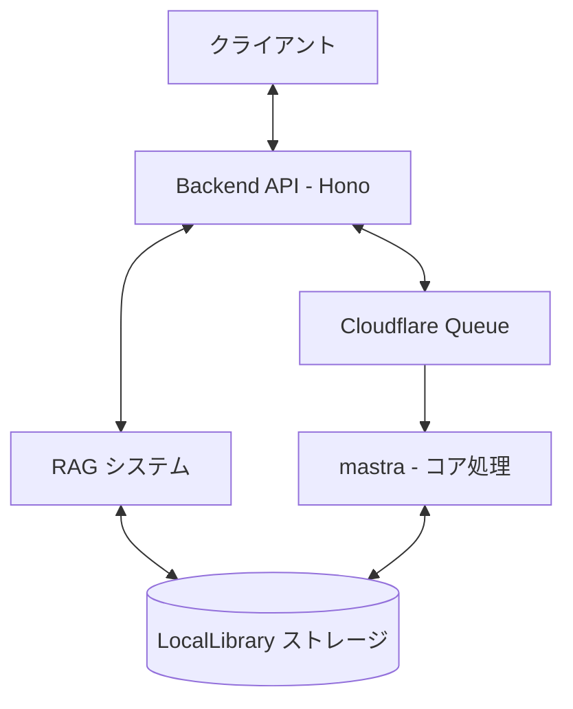
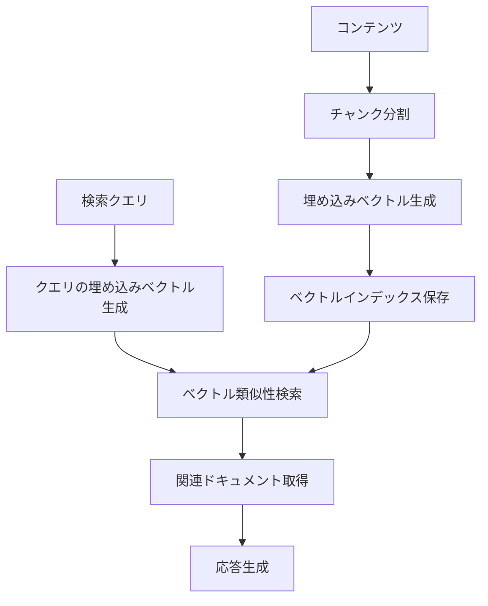
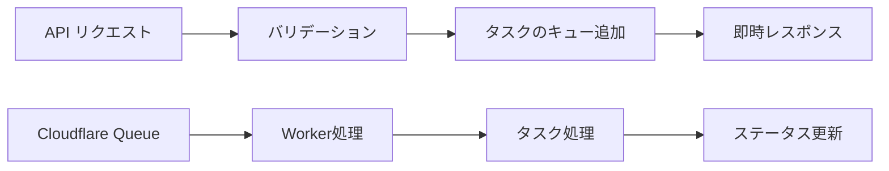

# データ設計ドキュメント

## 1. システムアーキテクチャ概要



システムは大きく以下のコンポーネントから構成されます：

1. **Backend API (Hono)**: フロントエンドからのリクエストを受け付け、処理を振り分けるレイヤー
2. **Cloudflare Queue**: 書き込み処理を順次実行するためのキューイングシステム
3. **mastra**: コアロジックを担当するAIエージェントフレームワーク
4. **RAG システム**: 高速なコンテキスト読み出しを実現する検索システム
5. **LocalLibrary**: 構造化されたデータを保存するストレージ

## 2. ディレクトリ構成

```
LocalLibraryforLLM/
├── backend/         # Hono API レイヤー
│   └── src/
│       ├── api/     # API エンドポイント定義
│       ├── models/  # データモデル定義
│       ├── queue/   # キュー処理関連
│       └── rag/     # RAG 関連機能
├── core/            # mastra コア機能
│   └── src/
│       ├── agents/  # エージェント定義
│       ├── storage/ # ストレージ操作
│       └── utils/   # ユーティリティ関数
└── docs/            # ドキュメント
```

## 3. データモデル設計

### 3.1 会話ログ（ConversationLog）

```typescript
interface ConversationLog {
  id: string;
  userId: string;
  timestamp: string;
  messages: Array<{
    role: 'user' | 'assistant';
    content: string;
    timestamp: string;
  }>;
  summary?: string;  // mastra によって生成される会話サマリー
  tags?: string[];   // 検索用タグ
  metadata?: Record<string, unknown>;  // 追加メタデータ
}
```

### 3.2 知識ベース（KnowledgeItem）

```typescript
interface KnowledgeItem {
  id: string;
  title: string;
  content: string;
  category: string;
  tags: string[];
  createdAt: string;
  updatedAt: string;
  source: {
    type: 'conversation' | 'manual' | 'import';
    referenceId?: string;  // 会話IDなど
  };
  embeddings?: number[];  // ベクトル表現（RAG用）
  metadata?: Record<string, unknown>;
}
```

### 3.3 TODO管理（TaskItem）

```typescript
interface TaskItem {
  id: string;
  title: string;
  description?: string;
  status: 'pending' | 'in-progress' | 'completed' | 'cancelled';
  priority: 'low' | 'medium' | 'high';
  createdAt: string;
  updatedAt: string;
  dueDate?: string;
  assignedTo?: string;
  relatedConversation?: string;  // 関連する会話ID
  metadata?: Record<string, unknown>;
}
```

## 4. API エンドポイント設計

### 4.1 会話管理API

- `GET /api/conversations` - 会話履歴一覧取得
- `GET /api/conversations/:id` - 特定の会話詳細取得
- `POST /api/conversations` - 新規会話記録 (Queue経由)
- `PUT /api/conversations/:id/summary` - 会話サマリー更新 (Queue経由)

### 4.2 知識ベースAPI

- `GET /api/knowledge` - 知識アイテム一覧取得
- `GET /api/knowledge/:id` - 特定の知識アイテム取得
- `POST /api/knowledge` - 知識アイテム追加 (Queue経由)
- `PUT /api/knowledge/:id` - 知識アイテム更新 (Queue経由)
- `DELETE /api/knowledge/:id` - 知識アイテム削除 (Queue経由)

### 4.3 RAG API

- `POST /api/rag/query` - 関連コンテキスト検索
- `POST /api/rag/index` - コンテンツのインデックス更新 (Queue経由)

### 4.4 TODO管理API

- `GET /api/tasks` - タスク一覧取得
- `GET /api/tasks/:id` - 特定のタスク取得
- `POST /api/tasks` - タスク作成 (Queue経由)
- `PUT /api/tasks/:id` - タスク更新 (Queue経由)
- `DELETE /api/tasks/:id` - タスク削除 (Queue経由)

## 5. RAGシステム実装アプローチ



### 5.1 実装コンポーネント

1. **テキスト処理**: コンテンツを適切なサイズのチャンクに分割
2. **埋め込みモデル**: テキストをベクトル表現に変換
3. **ベクトルデータベース**: 埋め込みベクトルの効率的な保存と検索
4. **検索ロジック**: 類似性スコアリングと関連コンテンツの取得
5. **インデックス更新**: 新しいコンテンツの追加と古いコンテンツの更新

### 5.2 Cloudflare D1とベクトル検索の組み合わせ

Cloudflare環境でRAGを実装するため、以下のアプローチを検討：

- Cloudflare D1 (SQLiteベース) をメタデータ保存に使用
- [pg_vector](https://github.com/pgvector/pgvector)または[redis-stack](https://redis.io/docs/stack/search/reference/vectors/)などのベクトルデータベースとの統合
- または、Cloudflare WorkersとWebAssemblyを利用した軽量ベクトル検索実装

## 6. Cloudflare キューイング設計



### 6.1 キュー処理タスクタイプ

1. **ConversationSummaryTask**: 会話履歴のサマリー生成
2. **KnowledgeIndexingTask**: ナレッジベース更新とインデックス作成
3. **TaskStatusUpdateTask**: TODOステータス更新

### 6.2 キュー処理フロー

1. クライアントからのリクエスト受信
2. リクエストデータのバリデーション
3. キューにタスク追加、クライアントに即時応答
4. ワーカーがキューからタスクを取得
5. タスク処理（mastraによる処理など）
6. 処理結果をストレージに保存
7. 必要に応じて通知・ステータス更新

## 7. mastraとの統合アプローチ

### 7.1 mastraの役割

1. **会話ログ分析**: CLINEとの会話履歴を分析しサマリー生成
2. **知識抽出**: 会話から重要な情報や「Why」の部分を抽出
3. **構造化データ生成**: 抽出した情報をLocalLibraryに適した形式に構造化
4. **タスク状態管理**: TODOの状態変更を記録

### 7.2 統合方法

1. **APIベース統合**: mastraを独立したサービスとして実装し、APIを通じて通信
2. **イベント駆動**: Cloudflareキューからイベントを受け取り、処理を実行
3. **バッチ処理**: 定期的にデータを処理してLocalLibraryを更新

### 7.3 検討すべき課題

1. **パフォーマンス最適化**: mastraの重い処理の効率化
2. **データ一貫性**: 非同期処理における一貫性の確保
3. **エラーハンドリング**: mastra処理失敗時の対応策
4. **デバッグ・モニタリング**: 複雑な処理フローの監視方法
